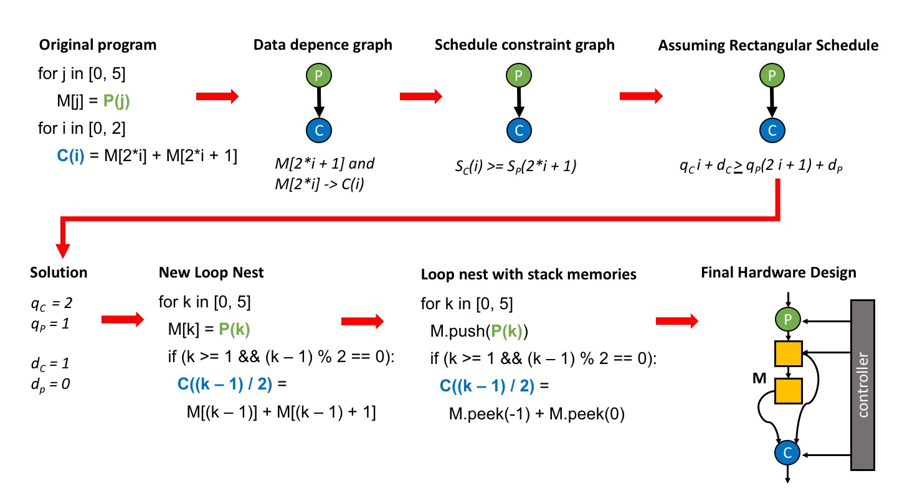

# Clockwork: Polyhedral Analysis for Hardware Accelerators

Clockwork is a tool for compiling naive descriptions of hardware accelerators written as loop nests into high performance, statically scheduled hardware.



## Important Files

* `build_set_test.cpp` - The main driver program
* `ubuffer.h` - The header file which stores the `UBuffer` class, which represents re-use buffers that store data between compute operations.
* `prog.h` - The header file which stores the `prog` class, which is the clockwork input representation.

## AWS F1 Quick Start

For a full setup script for AWS F1 with Developer AMI 1.8.1 see: [./misc/aws\_setup.sh](./misc/aws_setup.sh). From inside the top-level of the clockwork repo run the commands:

    source ./misc/aws_setup.sh
    ./rebuild_and_run.sh blur-example
    cd blur_example
    source ./set_app.sh
    make check TARGET=sw_emu DEVICE=$AWS_PLATFORM all 

This will install and build clockwork, run it to produce a blur over a 1920 x 1080 image and then run a software emulation of the blur using Xilinx Vitis.

## Installing Dependencies

Examples of how to install the dependencies can be found in [./misc/install\_deps\_mac.sh](./misc/install_deps_mac.sh) and [./misc/install\_deps\_linux.sh](./misc/install\_deps\_linux.sh).

Please install the specific versions of the listed dependencies. Do
not just take the latest release of NTL or barvinok.

* ntl-11.4.1 - [download here](https://shoup.net/ntl/download.html) 
    * https://www.shoup.net/ntl/doc/tour-unix.html (needs GMP to be installed already)
* barvinok-0.41 - [download here](http://barvinok.gforge.inria.fr/)
   * https://repo.or.cz/w/barvinok.git/blob/HEAD:/README - instructions for installing barvinok with ntl and GMP
   * note that linux users may need to manually add -lpthread to the LIBS field (change "LIBS = -lntl -lgmp", to "LIBS = -lpthread -lntl -lgmp")
* *optional codegen backend* **CoreIR** - [github link](https://github.com/rdaly525/coreir.git), install script: [./misc/install\_coreir.sh](./misc/install_coreir.sh).

### Miscellaneous Install Issues

When installing barvinok you may get the error:
```
    ./applications/testCompressParms.c:58:9: error: implicit declaration of function 'test_Constraints_Remove_parm_eqs' is invalid in C99
          [-Werror,-Wimplicit-function-declaration]
      TEST( test_Constraints_Remove_parm_eqs(A, B) )
            ^
    ./applications/testCompressParms.c:58:9: note: did you mean 'Constraints_Remove_parm_eqs'?
    ./include/polylib/compress_parms.h:73:10: note: 'Constraints_Remove_parm_eqs' declared here
    Matrix * Constraints_Remove_parm_eqs(Matrix ** M, Matrix ** Ctxt, 
             ^
    ./applications/testCompressParms.c:58:3: warning: using the result of an assignment as a condition without parentheses [-Wparentheses]
      TEST( test_Constraints_Remove_parm_eqs(A, B) )
      ^~~~~~~~~~~~~~~~~~~~~~~~~~~~~~~~~~~~~~~~~~~~~~
    ./applications/testCompressParms.c:36:26: note: expanded from macro 'TEST'
#define TEST(a) if (isOk = a) { \
                        ~~~~~^~~
    ./applications/testCompressParms.c:58:3: note: place parentheses around the assignment to silence this warning
    ./applications/testCompressParms.c:36:26: note: expanded from macro 'TEST'
#define TEST(a) if (isOk = a) { \
                             ^
    ./applications/testCompressParms.c:58:3: note: use '==' to turn this assignment into an equality comparison
    ./applications/testCompressParms.c:36:26: note: expanded from macro 'TEST'
#define TEST(a) if (isOk = a) { \
                             ^
    ./applications/testCompressParms.c:59:9: error: implicit declaration of function 'test_Polyhedron_Remove_parm_eqs' is invalid in C99
          [-Werror,-Wimplicit-function-declaration]
      TEST( test_Polyhedron_Remove_parm_eqs(A, B) )
            ^
    In file included from ./applications/testehrhart.c:35:
    ./include/polylib/homogenization.h:19:9: warning: 'HOMOGENIZATION_H' is used as a header guard here, followed by #define of a different macro [-Wheader-guard]
#ifndef HOMOGENIZATION_H
            ^~~~~~~~~~~~~~~~
    ./include/polylib/homogenization.h:20:9: note: 'HOMOGENIZATTON_H' is defined here; did you mean 'HOMOGENIZATION_H'?
#define HOMOGENIZATTON_H
            ^~~~~~~~~~~~~~~~
            HOMOGENIZATION_H
    ./applications/testCompressParms.c:59:9: note: did you mean 'Polyhedron_Remove_parm_eqs'?
    ./include/polylib/compress_parms.h:97:14: note: 'Polyhedron_Remove_parm_eqs' declared here
    Polyhedron * Polyhedron_Remove_parm_eqs(Polyhedron ** P, Polyhedron ** C, 
                 ^
    ./applications/testCompressParms.c:59:3: warning: using the result of an assignment as a condition without parentheses [-Wparentheses]
      TEST( test_Polyhedron_Remove_parm_eqs(A, B) )
      ^~~~~~~~~~~~~~~~~~~~~~~~~~~~~~~~~~~~~~~~~~~~~
    ./applications/testCompressParms.c:36:26: note: expanded from macro 'TEST'
#define TEST(a) if (isOk = a) { \
                        ~~~~~^~~
    ./applications/testCompressParms.c:59:3: note: place parentheses around the assignment to silence this warning
    ./applications/testCompressParms.c:36:26: note: expanded from macro 'TEST'
#define TEST(a) if (isOk = a) { \
                             ^
    ./applications/testCompressParms.c:59:3: note: use '==' to turn this assignment into an equality comparison
    ./applications/testCompressParms.c:36:26: note: expanded from macro 'TEST'
#define TEST(a) if (isOk = a) { \
                             ^
    ./applications/testCompressParms.c:60:9: error: implicit declaration of function 'test_Constraints_fullDimensionize' is invalid in C99
          [-Werror,-Wimplicit-function-declaration]
      TEST( test_Constraints_fullDimensionize(A, B, 4) )
            ^
    ./applications/testCompressParms.c:60:9: note: did you mean 'Constraints_fullDimensionize'?
    ./include/polylib/compress_parms.h:65:6: note: 'Constraints_fullDimensionize' declared here
    void Constraints_fullDimensionize(Matrix ** M, Matrix ** C, Matrix ** VL, 
         ^
    ./applications/testCompressParms.c:60:3: warning: using the result of an assignment as a condition without parentheses [-Wparentheses]
      TEST( test_Constraints_fullDimensionize(A, B, 4) )
      ^~~~~~~~~~~~~~~~~~~~~~~~~~~~~~~~~~~~~~~~~~~~~~~~~~
    ./applications/testCompressParms.c:36:26: note: expanded from macro 'TEST'
#define TEST(a) if (isOk = a) { \
                        ~~~~~^~~
    ./applications/testCompressParms.c:60:3: note: place parentheses around the assignment to silence this warning
    ./applications/testCompressParms.c:36:26: note: expanded from macro 'TEST'
#define TEST(a) if (isOk = a) { \
                             ^
    ./applications/testCompressParms.c:60:3: note: use '==' to turn this assignment into an equality comparison
    ./applications/testCompressParms.c:36:26: note: expanded from macro 'TEST'
#define TEST(a) if (isOk = a) { \
```

If you get this error you can fix it by manually pasting the test function declarations above the main function in `testCompressParams.c`
  

## Setting Your private\_settings.sh

The clockwork build script requires some paths and environment variables to be set in
a script called `./user_settings\private_settings.sh`. You will need to create this script
since each user has their own private settings. Several example private settings
files can be found in `./user_settings/`. In particular if you used [./misc/install\_deps\_linux.sh](./misc/install\_deps\_linux.sh) you will probably want to use [./user_settings/linux\_settings\_template.sh](./user_settings/linux\_settings\_template.sh).

# Building an example 

To generate a synthesizable accelerator which blurs a 1920 x 1080 grayscale image:

    ./rebuild_and_run.sh blur-example

This will write HLS code for the accelerator and several different test drivers for it to `./blur_example`. To run a software emulation of the accelerator do:

    clang++ -std=c++11 ./blur_example/blur_example_opt_sw_bmp_test_harness.cpp ./blur_example/blur_example_opt.cpp -I ./aws_collateral/ -I .
    ./a.out

This will run the accelerator in simulation on a `bmp` image and write the output to `./images/blur_example_opt_bmp_out.bmp`.

# Creating your own inputs

A simple example of how to generate and compile clockwork programs can be found in [./simple\_example\_progs.cpp](./simple_example_progs.cpp). It can be run with the command:

    ./rebuild_and_run.sh simple-example-progs

# Running all tests

* Default build and execute script which will execute all tests:

    `./rebuild_and_run.sh`

* Optional build with CoreIR backend

    `export COREIR_PATH=/path/to/coreir`
    
    `make -j COREIR=1`
    
The file `build_set_test.cpp` is the main driver for all tests.
Most files in this repository are automatically generated collateral
that can be ignored.

## Testing CGRA Memory Functionality with [Lake](https://github.com/StanfordAHA/lake) Verilog Generation.

For AHA CGRA users, we provide interconnect-agonstic testing of memory tile configurations. 
### Add new application to the CGRA test
Put your application clockwork memory function inside `xxx_memory.cpp` in to `example_prog.cpp` and add to the header `example_prog.h`
Copy `xxx_compute.h` into the root directory `./` of this repo.
Copy `xxx_compute.json` into the `./coreir_compute/` directory of this repo.
Lastly, add your application into the top of `test_apps` vector in `test_single_port_mem` method in `build_set_test.cpp`.
```
void test_single_port_mem() {
    vector<prog> test_apps;
    
    //Add your new application here
    
    test_apps.push_back(conv_3_3());
    ...
}
```
### Command to run the CGRA test
The tests depend on CoreIR and Lake. Before running the lake tests, be sure to install CoreIR and Lake. 
Add the following path to `./user_settings/private_settings.sh`
```
export COREIR_PATH=/path/to/coreir
export LAKE_PATH=/path/to/lake
export LAKE_CONTROLLERS=$PWD
```
Command to run the verilog functionality test.
```
./rebuild_and_run.sh lake-tests
```
If you just want to check the configuration generation without functionality test, run the following command
```
./rebuild_and_run.sh lake-exp
```

## Beware of AP\_INT\_MAX\_W

Vivado users may want to comment out `AP_INT_MAX_W` in `hw_classes.h`. It can cause very long compile times and is only needed for pipelines with very large unrolling factors.

